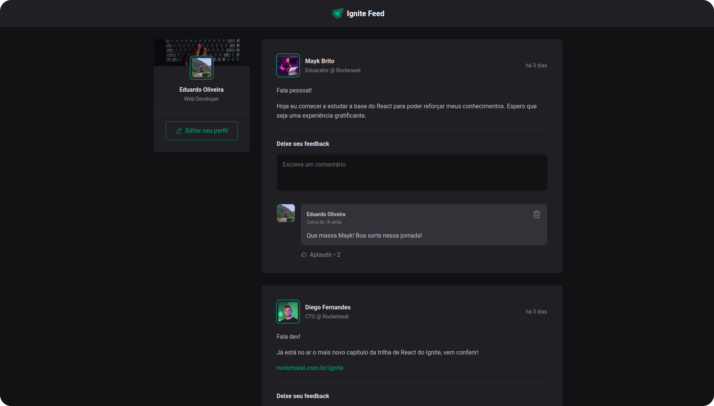

  
  <h1>Ignite Feed</h1>

## About
Ignite Feed is a simple version of a social media feed. The main goal of this project was to review and practice some of the core features of React.

## Layout
You can access the project's layout by clicking <a href="https://www.figma.com/community/file/1113573231685349036" target="_blank">here</a>.

## How to use
To run the project on your machine you can follow these steps:
- Open a terminal and type `git clone https://github.com/Eduardo-H/ignite-feed.git`
- Navigate into the project's folder with `cd ignite-feed/`
- Install all the dependencies with `yarn`
- Run `yarn dev` to start the project